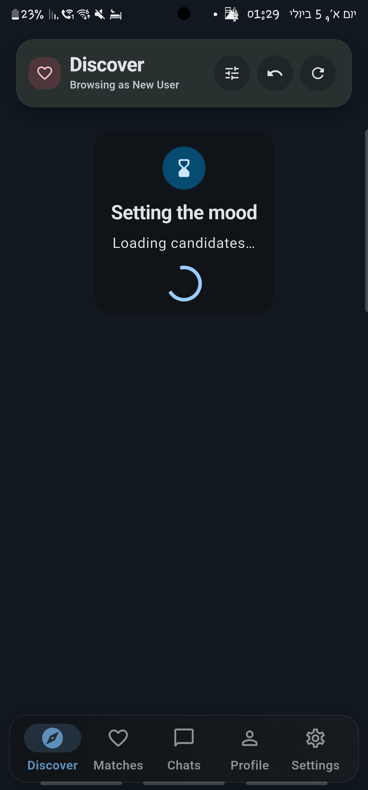
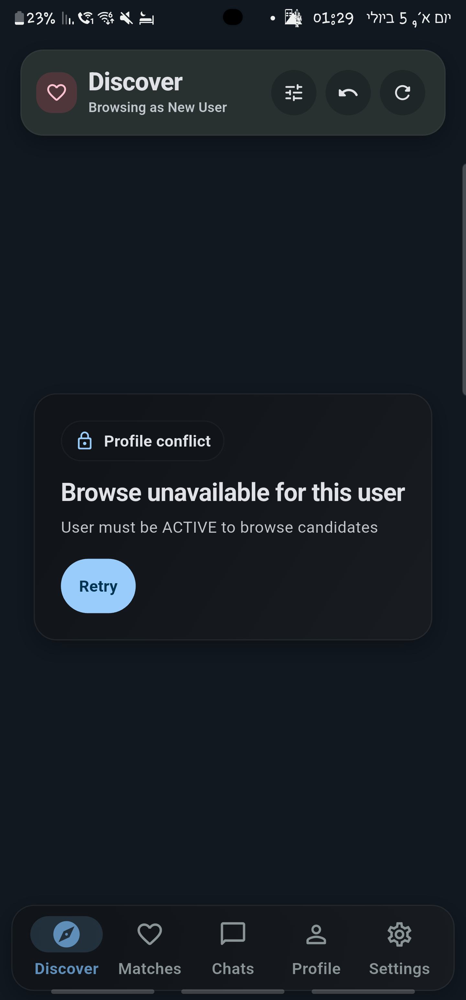

# Flutter Dating Application Frontend

A production-grade mobile dating client built with Flutter, Riverpod, and Material 3, demonstrating thin-client architecture over a RESTful microservice backend. The application implements the complete user discovery and relationship lifecycle—featuring swipable discovery profiles, real-time message polling, photo curation, community moderation flows, and automated visual regression testing across all 19 application screens.

  
  &nbsp; &nbsp;
  

---

## 1. Project Overview & Architecture

This repository contains the mobile frontend for a high-performance dating platform. It is engineered with a strict **thin client** boundary:
- **Flutter owns**: UI presentation, device lifecycle, reactive state management, client-side navigation, form validation, and polite network polling.
- **Backend owns**: Recommendation algorithms, matching, conversation persistence, moderation/safety enforcement, identity verification, and geolocation lookups.

The client strictly avoids domain logic duplication (e.g. fabricating compatibility scores or guessing moderation states), adhering to contract-driven communication over REST/JSON.

`
┌────────────────────────────────────────────────────────┐
│                   Flutter UI Layer                     │
│    (12 Feature Modules · Material 3 Design System)     │
└──────────────────────────┬─────────────────────────────┘
                           │ watches / invokes
┌──────────────────────────▼─────────────────────────────┐
│             Riverpod State & View Models               │
│   (NotifierProviders · FutureProviders · Auth Guard)   │
└──────────────────────────┬─────────────────────────────┘
                           │ coordinates
┌──────────────────────────▼─────────────────────────────┐
│                 Centralized API Layer                  │
│  (Dio · QueuedInterceptor · FlutterSecureStorage Auth) │
└──────────────────────────┬─────────────────────────────┘
                           │ HTTPS / REST (JSON)
┌──────────────────────────▼─────────────────────────────┐
│             Java 25 Microservice Backend               │
│        (Javalin · PostgreSQL · Business Logic)         │
└────────────────────────────────────────────────────────┘
`

---

## 2. Core Features & User Journeys

- **Discovery & Standouts:** Multi-surface candidate discovery with swipe/browse modes, Standouts daily curation, optimistic pass/like actions, and instant mutual-match notifications.
- **Matches & Real-Time Chat:** Polled conversation threads (20s background interval with visible viewport throttle), optimistic message dispatch, unread conversation badges, and deep navigation to match profiles.
- **Profile & Photo Management:** Profile completion checklist, bio/interests editing, interactive photo gallery manager (upload, reorder, delete) powered by image_picker.
- **Identity & Verification:** Multi-step photo verification flow with status checks and badging.
- **Trust & Safety:** In-app moderation sheet offering blocking, user reporting with categorization, and unmatching with mutual conversation archiving.
- **Onboarding & Auth:** Real JWT access/refresh token authentication flow (with automatic token renewal) plus a development user switcher for rapid QA across personas.
- **System Settings:** Dynamic Material 3 theme mode toggle (System, Light, Dark) with persisted user preferences.

---

## 3. Technical Highlights & Engineering Decisions

### Modern State Management (Riverpod 3)
- Pure declarative architecture leveraging lutter_riverpod 3.x.
- Scoped providers with explicit auto-invalidation, fine-grained view models, and deterministic session guards (selectedUserGuard).
- Dependency injection via ProviderScope overrides in unit, widget, and visual tests without requiring brittle mocks.

### Resilient Auth & Token Lifecycle
- Seamless access and refresh token lifecycle orchestration using Dio's QueuedInterceptor (uth_refresh_interceptor.dart).
- Background token renewal prevents race conditions when concurrent requests encounter an expired JWT.
- Secure token persistence using FlutterSecureStorage with automated fallback migration from legacy stores.
- Global session expiration event bus cleanly reroutes expired sessions to the authentication flow.

### Centralized Design System
- Canonical design tokens specified in [docs/design-language.md](docs/design-language.md).
- Zero magic numbers: standardized spacing scales, card radiuses, elevation tokens, and semantic state badges.
- Standardized surface archetypes (ShellHero, SectionIntroCard, AppAsyncState) ensure visual coherence across all 19 screens.

---

## 4. Automated Visual Regression Testing

The repository includes a custom, headless visual regression harness located in 	est/visual_inspection/:
- **19 Complete Screens:** Renders every primary screen in both light and dark themes at a fixed 412×915 mobile viewport.
- **Deterministic Fixtures:** Employs offline mock models, eliminating network flakiness.
- **Pixel-Accurate Typography:** Bundles and loads custom system fonts directly into the Flutter test engine.
- **Automated Retention:** Includes automated pruning scripts and generates a browsable HTML gallery (isual_review/index.html) for visual QA reviews.

To run the visual suite:
`powershell
flutter test test/visual_inspection/screenshot_test.dart
`

---

## 5. Repository Structure

`	ext
lib/
├── api/             # Centralized Dio client, endpoints, interceptors, auth token holder
├── app/             # App root (DatingApp), AppConfig, Env loaders
├── features/        # Modular feature slices
│   ├── auth/        # Sign-up, login, token refresh, and dev-user picker
│   ├── browse/      # Discover swiper, Standouts curation, undo action
│   ├── chat/        # Polled conversation thread and chat message list
│   ├── home/        # Signed-in shell with IndexedStack navigation
│   ├── location/    # Location resolution and autocomplete
│   ├── matches/     # Mutual match list and connection cards
│   ├── notifications/# In-app notifications and OS local notification platform service
│   ├── profile/     # Profile editor, photo management, completion checklist
│   ├── safety/      # Block, report, and unmatch modal action sheets
│   ├── settings/    # Theme switcher and user preferences
│   ├── stats/       # User engagement metrics and achievements
│   └── verification/# Photo verification stepper and status
├── models/          # Immutable, hand-written JSON serialization DTOs
├── shared/          # Reusable widgets, media pickers, persistence, formatters
└── theme/           # Material 3 light and dark theme configurations
`

---

## 6. Local Setup & Configuration

### Prerequisites
- **Flutter SDK:** >=3.35.0 (Dart >=3.11.5 <4.0.0)
- **Android SDK:** Platform 34+ / JDK 17+ (for Android builds)

### Environment Configuration
The application reads runtime configuration via compile-time defines. A template is provided at .env.example:

1. Copy .env.example to .env:
   `powershell
   Copy-Item .env.example .env
   `
2. Adjust DATING_APP_API_BASE_URL according to your target runtime:
   - **Android Emulator:** http://10.0.2.2:7070
   - **Windows Desktop / Web:** http://127.0.0.1:7070
   - **Physical Device:** http://<YOUR_LAN_IP>:7070

### Launching the Application
Run with the explicit --dart-define-from-file flag:
`powershell
# Run on Windows Desktop
flutter run -d windows --dart-define-from-file=.env

# Run on Android Emulator
flutter run -d emulator-5554 --dart-define-from-file=.env

# Run on Chrome
flutter run -d chrome --dart-define-from-file=.env
`

---

## 7. Verification & Testing

The project maintains extensive unit, provider, and widget test coverage across all features:

`powershell
# Run static analysis
flutter analyze

# Run complete unit and widget test suite
flutter test

# Run API interceptor and auth token store tests
flutter test test/api/
flutter test test/features/auth/

# Run visual inspection harness
flutter test test/visual_inspection/screenshot_test.dart
`

---

## 8. Documentation Reference

- [docs/design-language.md](docs/design-language.md) — Canonical design system and visual component hierarchy.
- [docs/visual-review-workflow.md](docs/visual-review-workflow.md) — Screenshot regression methodology and maintenance guide.
- [docs/specs/backend-contract-handoff.md](docs/specs/backend-contract-handoff.md) — Server REST specifications and payload contracts.
- [docs/specs/frontend-agent-guide.md](docs/specs/frontend-agent-guide.md) — Architectural boundary principles and API cheat sheet.
- [docs/plans/](docs/plans/) — Historical and future release milestone plans.
- [AGENTS.md](AGENTS.md) — Operating guidelines and verified toolchain constraints.
